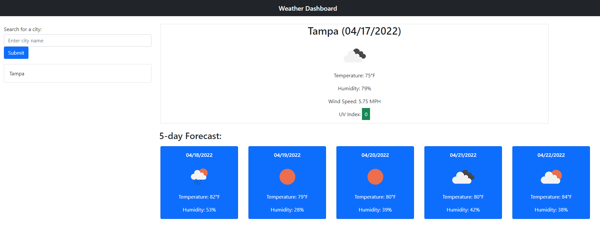

# Weather Dashboard

## Purpose
Build a weather dashboard that will run in the browser and feature dynamically updated HTML and CSS.

Use the OpenWeather One Call API to retrieve weather data for cities based on user input.

## Project Scope and Requirements
* AS A traveler
* I WANT to see the weather outlook for multiple cities
* SO THAT I can plan a trip accordingly

* GIVEN a weather dashboard with form inputs
* WHEN I search for a city
* THEN I am presented with current and future conditions for that city and that city is added to the search history
* WHEN I view current weather conditions for that city
* THEN I am presented with the city name, the date, an icon representation of weather conditions, the temperature, the humidity, the wind speed, and the UV index
* WHEN I view the UV index
* THEN I am presented with a color that indicates whether the conditions are favorable, moderate, or severe
* WHEN I view future weather conditions for that city
* THEN I am presented with a 5-day forecast that displays the date, an icon representation of weather conditions, the temperature, the wind speed, and the humidity
* WHEN I click on a city in the search history
* THEN I am again presented with current and future conditions for that city

## Built and Powered With
* HTML
* CSS
* Javascript
* Bootstrap
* FontAwesome
* Moment.js

## Website
[Product of MNlegion](https://github.com/MNlegion/Whats-the-weather)

## GitHub
[MNlegion Profile](https://github.com/MNlegion)

## Contribution
Made with ❤️ by MNlegion - Rob Kreuser